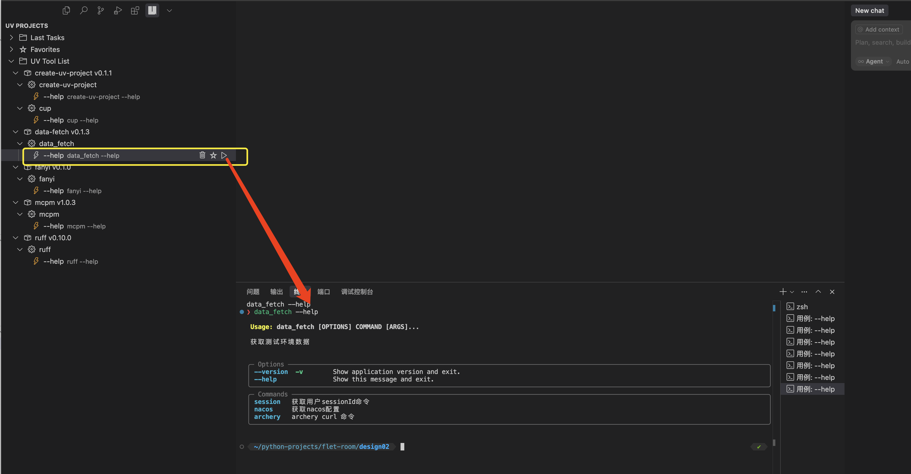
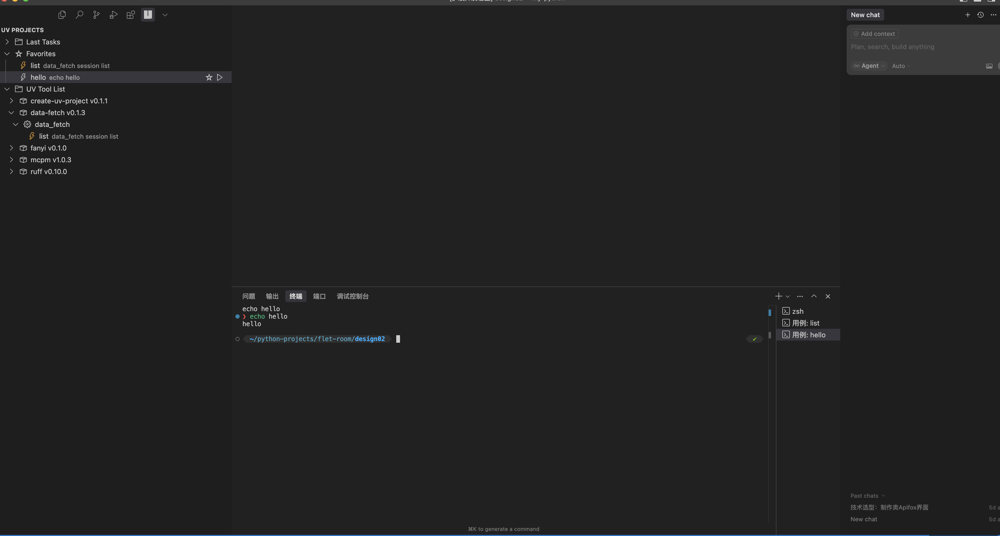
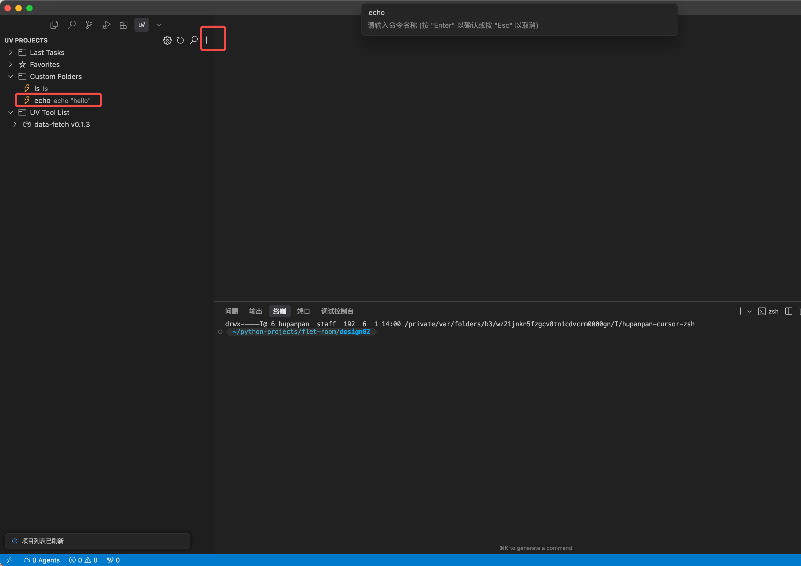
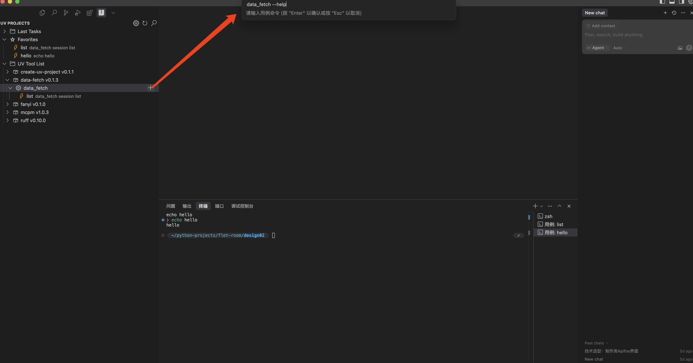

# UV Tool Manager VS Code 插件

[English README](./README.en.md)

**UV Tool Manager** 是一款专为 [uv tool](https://docs.astral.sh/uv/) 生态打造的 VS Code 扩展，帮助你在 VS Code 内高效管理所有 uv 工具、保存常用用例，并一键在终端执行。  
适合频繁使用 uv 工具、需要批量管理和复用命令的开发者。

---

## 主要特性

- **自动加载 uv 工具**  
  启动时自动解析本地 `uv tool list`，分组展示所有可用工具。
- **自定义命令**
  添加自定义shell命令,执行,管理
- **用例管理**  
  支持为每个工具创建、保存、删除和编辑用例（如常用命令、参数组合等）。
- **一键执行用例**  
  选中用例即可在 VS Code 终端直接运行，无需手动输入命令。
- **用例收藏夹与最近任务**  
  常用用例可收藏，最近执行任务自动记录，便于快速复用。
- **模糊搜索**  
  支持对工具和用例的快速搜索定位。
- **配置导入导出**  
  一键备份/迁移所有用例和配置，数据安全有保障。

---

## 插件界面截图

**主界面：**



**添加自定义命令**

**添加用例**




---

## 项目结构

```
uv-tool-manager/
├── src/
│   ├── extension.ts              # 插件主入口
│   ├── views/                    # Webview 视图
│   │   └── KeybindingsView.ts
│   ├── services/                 # 业务服务
│   │   ├── SettingsService.ts
│   │   ├── CaseService.ts
│   │   └── CommandService.ts
│   ├── models/                   # 数据结构
│   │   ├── Case.ts
│   │   ├── Command.ts
│   │   └── Settings.ts
│   └── providers/                # 树视图数据提供者
│       └── UvToolProvider.ts
├── media/                        # 静态资源（截图、图标等）
├── out/                          # 编译输出
├── package.json                  # 插件描述、命令、菜单等
├── tsconfig.json                 # TypeScript 配置
└── ...
```

---

## 功能简介

- 支持 uv 工具命令的可视化管理
- 最近任务、收藏夹、快捷键绑定
- **自定义命令管理（Custom Folders）**：可自定义添加任意命令，统一管理
- 支持命令/用例/自定义命令的模糊搜索
- 配置导入导出

---

## 自定义命令（Custom Folders）

- 在侧边栏"Custom Folders"节点下，集中管理你自定义的命令。
- 点击视图右上角的"+"按钮（Add New Command），即可添加自定义命令。
- 添加后可像普通命令一样运行、收藏、删除。
- 搜索功能也会检索自定义命令。
- 可通过设置菜单清空所有自定义命令。

---

## 安装与运行

1. 克隆本仓库并安装依赖：
   ```bash
   git clone https://github.com/angrypandahu/uv-tool-manager.git
   cd uv-tool-manager
   npm install
   ```
2. 在 VS Code 中按 F5 启动调试，或运行 `Run Extension` 任务。
3. 侧边栏会显示"项目管理器"视图，右键菜单和顶部按钮可进行各类操作。

---

## 常见问题

- **工具列表为空？**
  - 请确保本地已正确安装 uv 工具，并能在命令行执行 `uv tool list`。
  - uv 安装 https://docs.astral.sh/uv/
- **用例无法执行？**
  - 请检查用例命令格式，或在终端手动测试。
- **数据丢失？**
  - 插件所有数据均存储在 VS Code 全局存储中，升级/重装不会丢失。
  - 可通过"导出配置/导入配置"功能备份和迁移。

---

## 联系方式

如有建议或问题，欢迎提 Issue 或联系作者：
- GitHub: [https://github.com/angrypandahu/uv-tool-manager]
- 邮箱: angrypandahu@163.com

